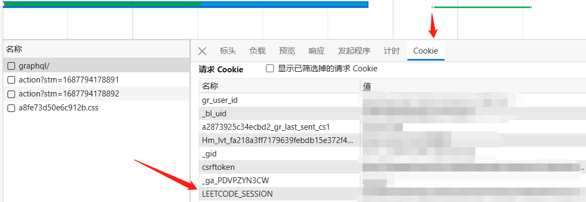
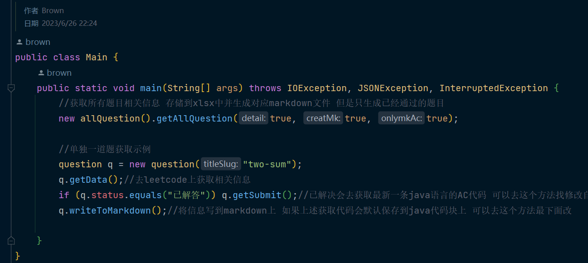
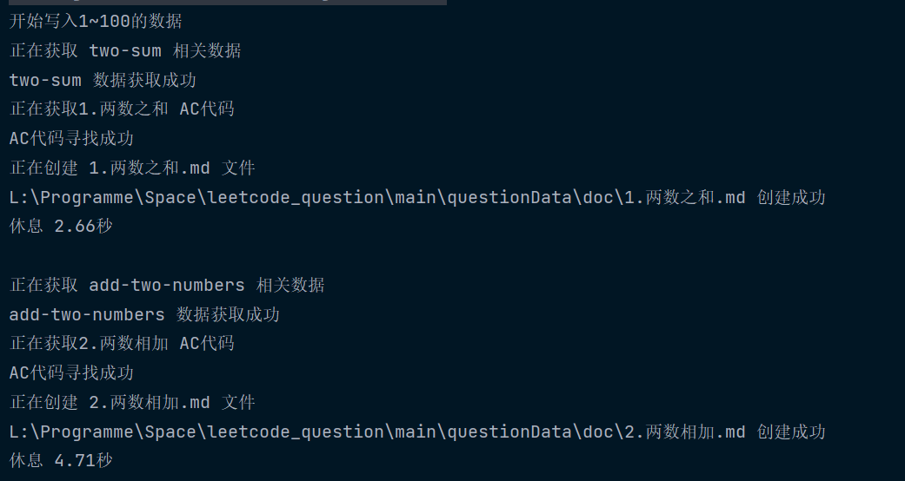
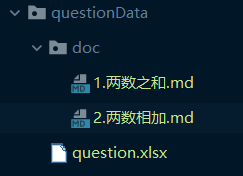
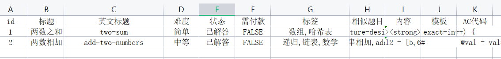
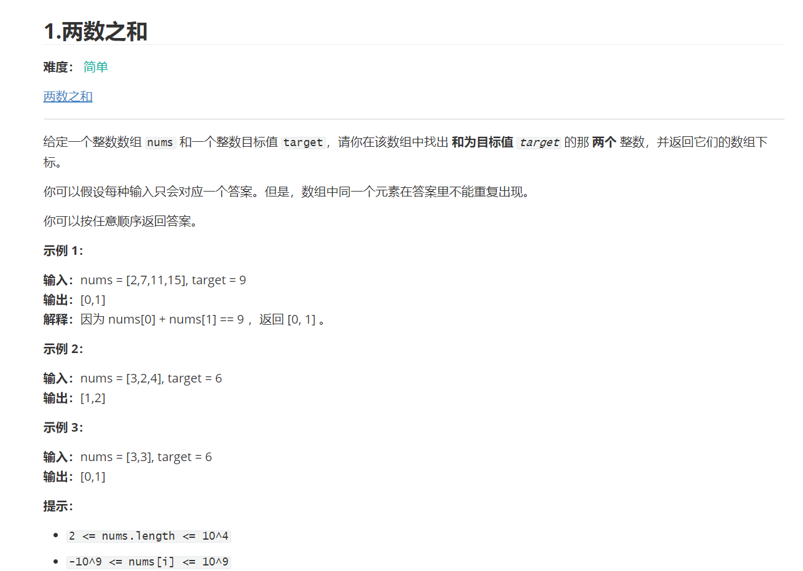
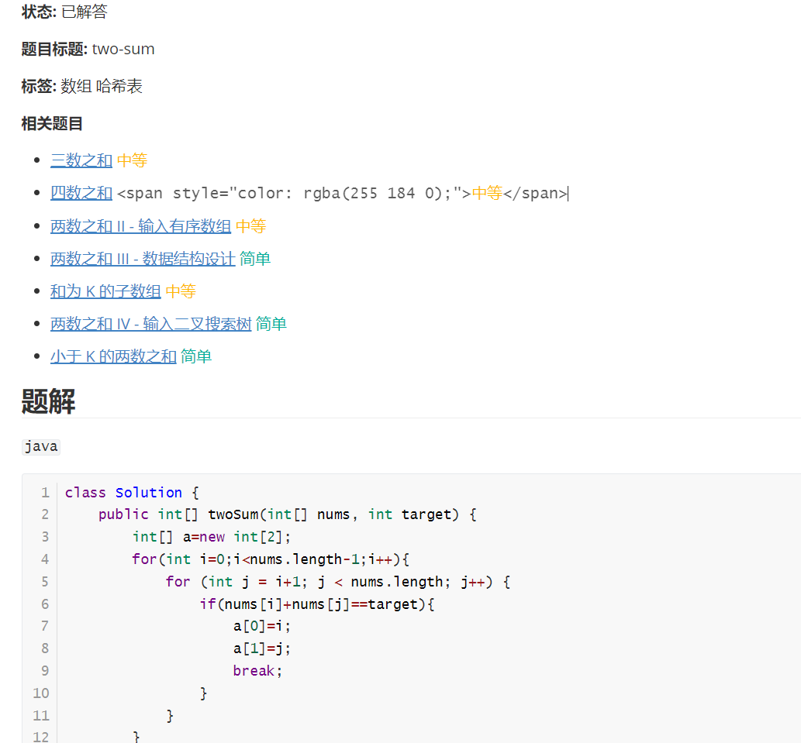

# leetcode_question
获取leetcode题目并将其保存到xlsx和markdown文件上

原理是通过模拟`leetcode`的`gtaphQl`请求来获取信息

**==如果对您有帮助请帮我点个赞 感谢您的支持==**

## 演示步骤

1. 修改`settings.properties`文件内容尤**其是要加上自己的`leetcode_session`**

   >leetcode_session登录leetcode网页版 F12->网络->Cookie->Leetcode_session
   >
   >不加上好像也行 就是没办法获得自己写题的具体情况 可能运行时也会报错

   

```
# 题目生成的markdown的命名格式 不用加上.md
# ${id} 表示id ${title}表示中文标题以此类推 注意有些题目没有中文标题 此时就会用英文标题代替
question.markdown_format=${id}.${title}
# 题目生成的markdown存放路径
question.markdown_path=main/questionData/doc
# 题目基本信息存放路径 生成xlsx
question.xlsx_path=main/questionData/question.xlsx
# 题目需要保存模板的编程语言 请至少留一种
question.onlyTemplates=java,cpp,python
# 请求session
request.session=
# 问题详细url
request.url=https://leetcode.cn/
# 获取信息的url 一般不用改
request.graphql_url=https://leetcode.cn/graphql/
```

2.运行`Main`分别为所有题目获取和单独一题获取



## 运行结果

运行时结果



文件生成



xlsx生成



markdown生成



如果已经解答会填充最新的一条java语言的AC代码



## 函数介绍

### `allQuesion`

1. `void getAllQuestion(boolean detail, boolean creatMk, boolean onlymkAc)`

获取`leetcode`题目的基本信息 有些题目的标题会有空格 也有的不会有中文题目 具体获取内容如下

```
String[] Head = {"id", "标题", "英文标题", "难度", "状态", "需付款", "标签", "相似题目", "内容", "模板", "AC代码"};
```

 `detail`为是否保存详细信息 具体的为保存

`"相似题目", "内容", "模板", "AC代码"`

` creatMk`是否创建`markdown`模板

`onlymkAC` 仅仅创建AC的题目`markdown`文件

每次获取100到题目 **会根据`xlsx`文件存储数量自动向后获取 中途退出也没问题**

如果需要获取详细题目 会休眠一会 建议还是让电脑休息会不要一下子全部请求


2.`HashMap<String, question> readAllQuestion()`

读取生成的`xlsx`文件将读取到的信息存储一个`HashMap`中

 `key`这个对象的`question`的`id`      

`value`将一行数据转化为一个`question`对象

可在本函数的最后几行修改为自己所需要的键值

```java
		.....
    	cell = row.getCell(10);
		Q.code = cell != null ? cell.toString() : "";
		map.put(Q.id, Q);  //修改这里就可以
	}
	workbook.close();
	return map;
}
```

### `question`

1.构造方法

这个为主要的 创建对象时候可以初始指认该题目的英文标题和AC代码 因为`leetcode`的API是以英文标题搜索的 

```java
public question(String titleSlug, String code) {
    this.titleSlug = titleSlug;
    this.code = code;
}
```


2.`boolean getData()`

根据当前对象的`titleSlug`来获取题目的相关信息并存储到当前类中 若没有配置`titleSlug`则不会获取数据

> 这个其实可以修改成`static` 将`titleSlug`作为传入值 即
>
> `public static question getData(String titleSlug)`
>
> 但是需要在创建一个`question`再把数据给其赋值 有点浪费空间(我猜的) 可以根据自身喜好更改


3.`void getSubmit()`

尝试获取AC的代码 并将其赋值到`code`属性中

如果没有AC的`java`代码什么都不会发生 所以可以先判断`status.equals("已解答")`再来去顶是否执行这个代码

可以修改方法来获取自己需要的编程语言 也可以将`code`由字符串变成`HashMap<String,String>`

``` java
//可以在这里修改自己需要的编程语言 
if (submit_status.equals("Accepted") && submit_lang.equals("java")) {
    code = data.getString("code");//可以修改code的类型来存储更多AC的模板代码
}
```

> 没有将这个函数放入到`getData()`是因为大部分题目都没有AC(本人只有350AC很弱鸡)
>
> 此时 获取提交的信息无疑是在浪费时间 


4.`boolean writeToMarkdown()`

将本类的各个信息生成一个`markdown`文件

其中`markdown`命名格式可以去`settings.properties`中修改

```
# 题目生成的markdown的命名格式 不用加上.md
# ${id} 表示id ${title}表示中文标题以此类推 注意有些题目没有中文标题 此时就会用英文标题代替
question.markdown_format=${id}.${title}
```

**并且请确保`question.onlyTemplates`至少有一种模板代码** 如果不需要模板代码可自行删除对应代码

```
# 题目需要保存模板的编程语言 请至少留一种
question.onlyTemplates=java,cpp,python
```
可以修改相应的逻辑来自定义自己想要保存的样式
笔者多是用`java`写`leetcode` 所以`java`会比较特殊

```
writer.write("## 题解\n");
String[] ls = onlyTemplates.split(",");
boolean java = false;
if (code.length() > 0) {
    writer.write("`java`\n``` java\n%s\n```\n\n".formatted(code));
    java = true;
}
for (String l : ls)
    if (!l.equals("java") || !java)
        writer.write("`%s`\n``` %s\n %s\n```\n\n".formatted(l, l, templates.get(l)));
```


